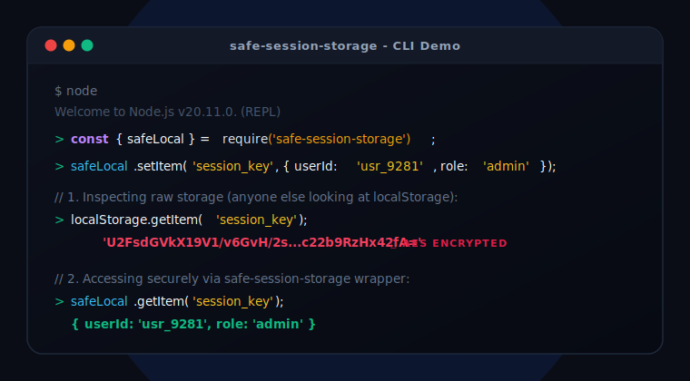

# safe-session-storage

A secure, lightweight wrapper for `localStorage`, `sessionStorage`, and `AsyncStorage` (React Native) with automatic encryption. Prevent casual inspection of your application's stored data across all platforms.



## Features

-  **Automatic Encryption**: Data is encrypted before being stored.
-  **React & React Native Support**: Hooks for both synchronous and asynchronous storage.
-  **SSR Friendly**: Works perfectly with Next.js and other SSR frameworks.
-  **Zero External Dependencies**: Lightweight and fast.
-  **Type Safe**: Full TypeScript support.

## Installation

```bash
npm install safe-session-storage
```

## Platform Support

### 1. Web (React, Vite, etc.)
Use `useSafeStorage` for synchronous `localStorage` or `sessionStorage`.

```tsx
import { useSafeStorage } from 'safe-session-storage';

function App() {
  const [theme, setTheme] = useSafeStorage('theme', 'light');
  // ...
}
```

### 2. Next.js (SSR)
`useSafeStorage` is SSR-safe. It detects the environment and returns the initial value during server-side rendering, then hydrates correctly on the client.

### 3. React Native
Use `useAsyncSafeStorage` with `@react-native-async-storage/async-storage`.

```tsx
import AsyncStorage from '@react-native-async-storage/async-storage';
import { useAsyncSafeStorage } from 'safe-session-storage';

function Profile() {
  const [user, setUser, loading] = useAsyncSafeStorage('user', null, {
    customStorage: AsyncStorage,
    secretKey: 'my-mobile-secret'
  });

  if (loading) return <Text>Loading...</Text>;
  // ...
}
```

## Usage

### Vanilla JavaScript / TypeScript

```typescript
import { safeLocal, SafeStorage, AsyncSafeStorage } from 'safe-session-storage';

// Web (Sync)
safeLocal.setItem('key', 'value');

// React Native / Custom (Async)
const asyncStore = new AsyncSafeStorage({ 
  customStorage: AsyncStorage,
  secretKey: 'key' 
});
await asyncStore.setItem('key', 'value');
```

## Why use this?

When you store data in storage engines, it is usually stored in plain text. Anyone with access to the device or a malicious script can easily read this data.

`safe-session-storage` obfuscates this data using XOR encryption and Base64 encoding. It works across:
- **Browsers**: Chrome, Firefox, Safari, Edge.
- **Server**: Node.js (SSR safe).
- **Mobile**: React Native (iOS/Android).

## API

### Web (Sync)
- `useSafeStorage(key, initialValue, options)`
- `safeLocal` / `safeSession` instances.
- `SafeStorage` class.

### Mobile/Custom (Async)
- `useAsyncSafeStorage(key, initialValue, options)`
- `AsyncSafeStorage` class.


## Contribution

Feel free to fork and improve this project! Pull requests are welcome.

## License

This project is licensed under the Apache-2.0 License.
